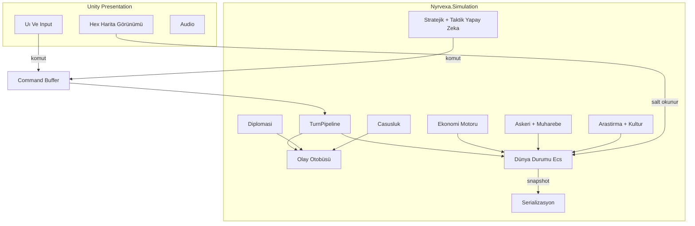

# Nyrvexa — 4X Ana Vizyon, Mimari ve Simülasyon Temeli

Bu belge **Nyrvexa** (çalışma adı) için ticari ürün hedefli, motor-bağımsız simülasyon stratejisini ve **Unity** sunum katmanını tanımlar. Kod giriş noktası: `Assets/Scripts/Simulation/`, `Assets/Scripts/Adapters/Unity/`.

**Kod eşlemesi (v0):** `Core/` kimlik + RNG — `Hex/AxialCoord` — `State/GameStateRoot` — `Loop/TurnPipeline` + `IPipelineStep` — `Events/` — `Commands/` — `Diplomacy/`, `Research/` iskelet — `AI/` arayüz — `Adapters/Unity/GameSessionHost` — `Persistence/IGameStateSerializer` — `StreamingAssets/Defs/*.json`.

---

## 1) Bu aşamada alınan ana tasarım kararları

| Karar | Gerekçe |
|--------|---------|
| **Turn-based deterministik simülasyon** | Multiplayer (hot-seat → ağ) ve kayıt tekrar üretilebilirliği için; aynı seed + aynı komut dizisi = aynı sonuç. |
| **Kademeli katman: Simülasyon ⟂ Sunum** | `Nyrvexa.Simulation` (saf C#, `UnityEngine` yok) — UI/3D/Audio ayrı assembly; test ve headless sunucu mümkün. |
| **ECS “hafif” model** | Her şey `EntityId` + bileşen depoları; ağır OOP ağaçları yerine veri-yerelli işlem (cache dostu, mod dostu). |
| **Eşzamanlı çözüm: komut (command) girdisi** | Ham input değil; `PlayerCommand` / `AICommand` kuyruğu; faz sonunda uygulama. |
| **Köşegen ekonomi: akış + stok** | Stellaris/Endless tarzı kaynak türleri; üretim grafı `RecipeDef` (data); şehir `Stockpile` + `Modifier` toplamı. |
| **Diplomasi: anlaşma (treaty) + güven (trust) + çıkar (wargoal)** | Paradox sözleşme modelinin sadeleştirilmişi; `DiploMatrix` (ilişki skorları) + `Treaty` listesi. |
| **AI: Utility (stratejik öncelik) + GOAP (taktik plan) + bütçe** | Ajan ham eylem araması yapmaz; “ne kadar acil / ne kadar kârlı” eşiği, sonra eylem dizisi. |
| **Dünya: heks, eksenel (axial) koordinat, chunk’lanabilir grid** | Geodesik/hex standardı; derin ileride warp opsiyonu. |
| **Görüş: tile başına maske; keşif = maske aç + birim SIGHT** | FOW; casusluk ayrı “bilgi sızıntısı” kanalı (şehir/ordu hakkında yarım doğru). |
| **Mod: JSON/Bundle manifest + def override** | Çekirdek `DefId` sabit; modlar `patch` / `add`; güvenli yükleme için imza/whitelist (v2). |

---

## 2) Sistem mimarisi

**Veri akışı (özet):** Input → `PlayerCommand` → (sıra) `TurnContext` → `IPipelineStep` zinciri → `IGameEvent` yayımları → durum mutasyonu (tek iş parçacığı kuralı) → `GameStateRoot` sürüm artışı.

**Paralel olmayan kural v1:** Simülasyon adımı tek iş parçacığı; ileride “salt okunur simülasyon + paralel taktik” konusu ayrı faz.

---

## 3) Oyun mekanikleri (bağlantılı alanlar)

- **Ana döngü:** Sıra → olay/ kriz (RNG deterministik) → ekonomi/üretim/araştırma → diplomasi taahhütleri → emirler → hareket → çarpışma çözümü (önce stratejik grid, isteğe bağlı taktik çözünür alt oturum) → şehir büyüme/nüfus → kültür baskısı → casusluk → tur sonu kazanma.  
- **Dünya:** Procedural/önsel harita; biyom, kaynak site, yollar; doğal afet = `CrisisEvent` şablonu.  
- **Genişleme:** Koloni kur = `FoundCity` komutu; bölge iddiası = kültür + askerî kontrol.  
- **Nüfus/mutluluk/isyankarlık:** `Unrest`, `Loyalty`, `Amenities` (Civ6 benzeri basitleştirilmiş); hükümet ve yasilar çarpan.  
- **Din/ideoloji:** IdeologyDef + baskı + misyoner/ propaganda (düşük öncelik v1, veri yuvası hazır).  
- **Ticaret:** Rota bütçesi; emtia akışı + gümrük (sınır) vergisi; ambargo diplomasi ile bağlı.  
- **Kazanma:** Bilim, hakimiyet, diplomasi (birleşme / federasyon), puan, senaryo.

Tüm 30 maddelik program bu çekirdeğe `Def` ve `IPipelineStep` eklemleriyle genişler (tek devasa “if” ağacı yok).

---

## 4) Veri modelleri (özet)

| Yapı | Amaç |
|------|------|
| `GameStateHeader` | Şema sürümü, seed, tur, oyun modu, checksum (ileride). |
| `GameStateRoot` | Tüm oyun: fraksiyonlar, harita, entity deposu, araştırma, diplo, savaş. |
| `DefId` / `StringId` | `readonly struct` + string havuzu; mod güvenli referans. |
| `EntityId` | Sıfır olmayan kimlik, nesil. |
| `AxialCoord` | Heks; komşu, mesafe, çizgi çekme. |
| `PlayerCommand` / `AICommand` | Seri hale getirilebilir komut. |
| `TechNodeState`, `FactionDiploState` | Ağ/ matris. |
| JSON DTO'lar (ileride) | `TechnologyDef`, `UnitDef`, `BuildingDef` — `StreamingAssets/Defs/`. |

---

## 5) C# / Unity kod iskeleti

- **Simülasyon:** `Assets/Scripts/Simulation/` — bu depoda mevcut.  
- **Unity giriş:** `GameSessionHost` — Editor’de tur ilerletme hattı.  
- Yeni Unity projesinde: bu `Assets` ve `docs` aynen eklenir; `Nyrvexa.Simulation` derlenir.

---

## 6) Dengeleme notları (çekirdek)

- Kârlılık: erken aşamada sınırlı inşaat slotu; geç aşamada büyüme maliyeti artan.  
- Savaş: yıpranma + tedarik; “tek birim türü her şeyi yenmez” — zırh, delme, alan, menzilli ayrı.  
- Araştırma: ağaçta “düğüm maliyeti” oyun hızı ile ölçeklenir; **fazla ağaç ucu** puan (diplomatik / kültürel) ile kapatılır.  
- Kultur: sınır aşınması hız sınırı (bir turda maks. X basınç kuyruğu).  
- Kriz: tetikleme ağırlıkları mutluluk, borç, savaş yorgunluğu ile ölçekli.

---

## 7) Test senaryoları (otomatize edilebilir)

| # | Ad | Beklenti |
|---|----|----------|
| T1 | Aynı seed, boş komut, N tur | Deterministik checksum (ileride) veya N tur sonu state hash. |
| T2 | Heks komşu | Koordinat → 6 komşu sayıları sabit. |
| T3 | Pipeline sıra | Aşamalar aynı sırada; araya event inject testi. |
| T4 | Komut uygulama | Geçersiz hedef reddedilir; oyun kilitlenmez. |
| T5 | RNG | Aynı seed ile aynı dizi. |

(Headless test projesi: ayrı `Nyrvexa.Simulation.Tests` .NET — ileri faz.)

---

## 8) Sonraki otomatik geliştirme adımı

1. `WorldMapState` (tile dizisi) + FOW maskesi.  
2. `FoundCity` / `MoveUnit` komut uygulayıcıları + birim/şehir bileşenleri.  
3. `EconomySystem` (stok, üretim tick).  
4. `ResearchSystem` (tech graph load from JSON).  
5. Editor veya `GameSessionHost` üzerinde **görsel olmadan** 50 tur “boş oyun” stresi.

---

## 9) AAA 4X Yürütme Runbook (SSOT, güncel hedef seti)

Ürün vizyonu, 30 sistem eşleme, mimari, test ve **sıradaki otomatik adımlar** (teknik direktörlük formatı): **[AAA_4X_DIRECTOR_RUNBOOK.md](./AAA_4X_DIRECTOR_RUNBOOK.md)**.

*Belge: Nyrvexa teknik yönetim / v0.1 — referans: Civilization, Stellaris, Endless Legend, Dune: Spice Wars, Total War kampanya, Paradox GDC dokümanları (tasarım ilhamı, kopya değil).*
